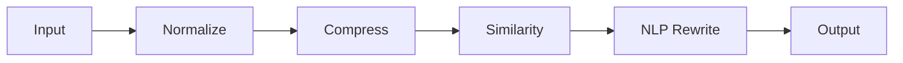

# promptz Wiki

Welcome to the extended documentation for **promptz**, the Token Efficiency Engine.

## Table of Contents
1. [Core Concepts](#core-concepts)
2. [Architecture Deep Dive](#architecture-deep-dive)
3. [Optimization Modes](#optimization-modes)
4. [NLP Techniques](#nlp-techniques)
5. [Benchmarks](#benchmarks)

---

## Core Concepts

**promptz** is designed to solve a specific problem: LLM prompts often contain "fluff" — polite phrasing, redundant context, and verbose sentence structures — that consume tokens without adding semantic value.

By removing this fluff, we:
- Reduce costs (fewer input tokens)
- Reduce latency (smaller payload)
- Increase effective context window (fit more relevant data)

## Architecture Deep Dive

The engine processes messages through a deterministic, linear pipeline:



1.  **Normalize**: Standardizes text (whitespace trimming, collapsing spaces).
2.  **Compress**: Uses regex patterns to strip parenthetical asides `(like this)` and filler phrases (`due to the fact that` → `because`).
3.  **Similarity**: Calculates Jaccard similarity between messages. If two messages are >70% similar (configurable), the shorter one is kept.
4.  **NLP Rewrite**: The heavy lifter. Uses Part-of-Speech tagging to identify the grammatical role of every word.

## Optimization Modes

| Mode | Behavior | Use Case |
|---|---|---|
| **Conservative** | No rewriting. Only normalization and exact dedup. | Strict legal/medical prompts where every word matters. |
| **Balanced** | Removes stop words (the, a, in) and filler phrases. | General purpose chat, RAG queries. |
| **Aggressive** | Keeps only **Content Words** (Nouns, Verbs, Adjectives, Adverbs). Drops everything else. | High-throughput data processing, log analysis summaries. |

## NLP Techniques

### POS Tagging (prose)
We use `jdkato/prose/v2`, a Go port of the famous TextBlob tagger. It uses a trained Averaged Perceptron model to tag words.
- **Why?** It handles context better than simple lookups. "Book a flight" (Book=Verb) vs "Read a book" (Book=Noun).

### TF-IDF Scoring
To prevent aggressive mode from deleting important "low value" words, we run TF-IDF across the message history.
- **Term Frequency (TF)**: How often a word appears in this message.
- **Inverse Document Frequency (IDF)**: How rare the word is across all messages.
- **Result**: Unique words that appear frequently locally are preserved, even if they aren't strict nouns/verbs. or unknown to the dictionary.

### Jaccard Similarity
Used for semantic deduplication.
$$ J(A,B) = \frac{|A \cap B|}{|A \cup B|} $$
If user says "Help me fix db" then "Please help fix db", overlap is high. We keep the shorter one.

## Benchmarks

*(Preliminary results on standard chat logs)*

| Prompt Type | Original Tokens | Optimised (Aggressive) | Reduction |
|---|---|---|---|
| Tech Support | 150 | 65 | **~56%** |
| General Chat | 45 | 30 | **~33%** |
### Benchmarks (Verified)

| Sample Name | Mode | Before | After | Reduction |
| :--- | :--- | :--- | :--- | :--- |
| Tech Support (Verbose) | balanced | 114 | 53 | **53.5%** |
| Tech Support (Verbose) | aggressive | 114 | 45 | **60.5%** |
| General Chat (Greeting) | balanced | 32 | 19 | **40.6%** |
| Code Request (Complex) | aggressive | 74 | 33 | **55.4%** |
| Repeated Context | aggressive | 26 | 13 | **50.0%** |

---

## Benchmarking Tool

You can run our automated benchmark suite to verify these figures on your own machine.

### Running Benchmarks
From the root of the repository, execute:
```bash
go run scripts/benchmark/main.go
```

The script will process samples from `scripts/benchmark/samples.json` using both `balanced` and `aggressive` modes, displaying a comparison table of token reductions.

### Custom Samples
To add your own test cases, simply append them to `scripts/benchmark/samples.json` in the following format:
```json
{
  "name": "My Custom Sample",
  "messages": [
    {"role": "user", "content": "Sample text here"}
  ]
}
```
